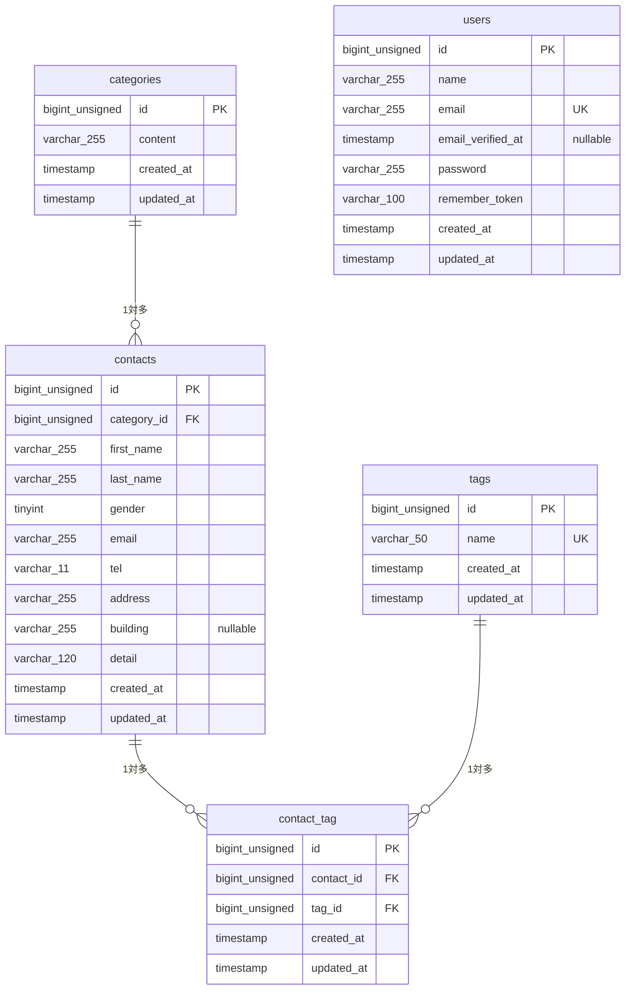

## 環境構築
**Dockerビルド**
1. `git clone https://github.com/Aira-14/Aira-kadai1`
2. DockerDesktopアプリを立ち上げる
3. 「.env.example」ファイルを コピーして「.env」を作成し、DBの設定を変更
``` text
DB_CONNECTION=mysql
DB_HOST=mysql
DB_PORT=3306
DB_DATABASE=laravel
DB_USERNAME=sail
DB_PASSWORD=password
```
4. 初期依存パッケージをインストールしてコンテナを起動する
```bash
docker run --rm \
   -v "$(pwd):/var/www/html" \
   -w /var/www/html \
   laravelsail/php82-composer:latest \
   composer install --ignore-platform-reqs

./vendor/bin/sail up -d
```

**Laravel環境構築**
1. 「.env.example」ファイルを コピーして「.env」を作成し、DBの設定を変更
``` text
DB_CONNECTION=mysql
DB_HOST=mysql
DB_PORT=3306
DB_DATABASE=laravel
DB_USERNAME=sail
DB_PASSWORD=password
```
2. アプリケーションキーの作成
``` bash
./vendor/bin/sail artisan key:generate
```

3. マイグレーションの実行
``` bash
./vendor/bin/sail artisan migrate
```

4. シーディングの実行
``` bash
./vendor/bin/sail artisan db:seed
```

## ER図


**フロントエンド環境構築（Vite / Tailwind CSS）**
1. 依存パッケージのインストール
``` bash
./vendor/bin/sail npm install
```
2. 開発サーバーの起動
``` bash
./vendor/bin/sail npm run dev
```

*注意: resources/css/app.css には、Tailwind CSSを有効化するため以下が記述されている必要があります*
```
@tailwind base;
@tailwind components;
@tailwind utilities;
```

## URL
- 開発環境：http://localhost
- phpMyAdmin:：http://localhost:8080
